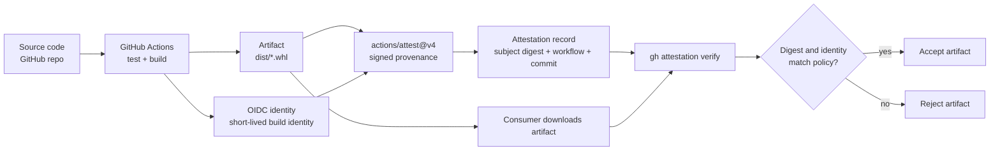
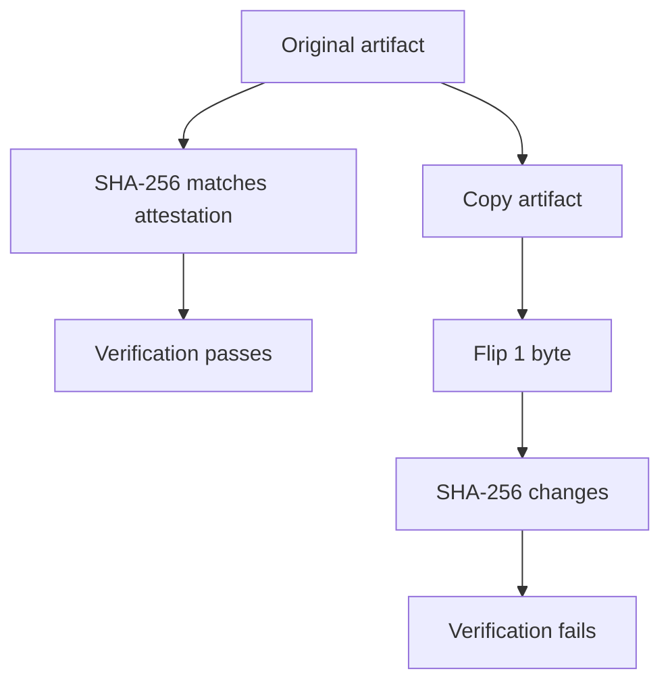

# Mermaid 圖

## Provenance flow

```mermaid
flowchart LR
    A["Source code<br/>GitHub repo"] --> B["GitHub Actions<br/>test + build"]
    B --> C["Artifact<br/>dist/*.whl"]
    B --> D["OIDC identity<br/>short-lived build identity"]
    C --> E["actions/attest@v4<br/>signed provenance"]
    D --> E
    E --> F["Attestation record<br/>subject digest + workflow + commit"]
    C --> G["Consumer downloads artifact"]
    F --> H["gh attestation verify"]
    G --> H
    H --> I{"Digest and identity<br/>match policy?"}
    I -->|yes| J["Accept artifact"]
    I -->|no| K["Reject artifact"]
```

## Tamper contrast

```mermaid
flowchart TD
    A["Original artifact"] --> B["SHA-256 matches attestation"]
    B --> C["Verification passes"]
    A --> D["Copy artifact"]
    D --> E["Flip 1 byte"]
    E --> F["SHA-256 changes"]
    F --> G["Verification fails"]
```

## 15-minute talk structure

```mermaid
gantt
    title 15-minute presentation timing
    dateFormat mm
    axisFormat %M
    section Talk
    Motivation and problem       :a1, 00, 2m
    Core concepts                :a2, after a1, 2m
    Why now: GitHub/SLSA/PyPI    :a3, after a2, 2m
    Implementation architecture  :a4, after a3, 2m
    Demo success and tamper fail :a5, after a4, 4m
    Limits and conclusion        :a6, after a5, 2m
    Q&A buffer                   :a7, after a6, 1m
```
